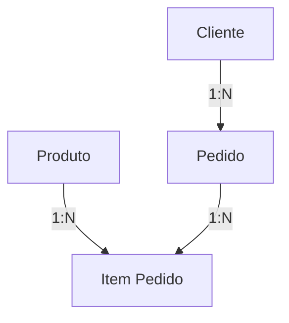

# 📱 API StoreManager


## 🚀 Visão Geral

A API StoreManager é uma solução robusta para gerenciamento de lojas, desenvolvida em ASP.NET Core 8.0 com C#. Esta API facilita operações essenciais de comércio, incluindo o gerenciamento completo de clientes, produtos, pedidos e itens de pedidos.

Com uma arquitetura bem estruturada seguindo padrões modernos de desenvolvimento, a API oferece endpoints organizados para todas as operações CRUD necessárias, consultas por faixas de preço e relacionamentos entre entidades.

Implementada com Entity Framework Core e documentada via Swagger, a solução é ideal para sistemas de e-commerce e gestão de vendas que necessitam de um backend robusto e escalável.

## 🛠️ Tecnologias Utilizadas

- ASP.NET Core 3.1
- .NET 8
- C# 12
- Entity Framework Core
- SQL Server
- Swagger/OpenAPI

## ⚙️ Pré-requisitos

- Visual Studio 2022
- .NET SDK 8.0
- SQL Server
- Git

## 🔄 Fluxo de Funcionamento

O sistema segue uma lógica específica para o relacionamento entre entidades:



### Fluxo de Criação de Pedido:

1. **Clientes e Produtos** são criados de forma independente através de suas respectivas rotas
2. Para criar um **Pedido**:
   - Primeiro, faça um `POST /api/pedido` com o ID do cliente para criar um pedido com valor total = 0
   - O sistema retorna o ID do pedido recém-criado
3. Para adicionar **Itens ao Pedido**:
   - Faça um `POST /api/itens` com o ID do pedido, ID do produto e quantidade
   - O sistema automaticamente calcula o subtotal do item e atualiza o valor total do pedido
   - Cada item adicionado incrementa o valor total do seu respectivo pedido
   - O ato de excluir ou alterar itens do pedido modifica diretamente o valor total.
   - É possível adicionar múltiplos itens ao mesmo pedido

Este fluxo permite a construção progressiva do pedido conforme itens são adicionados, refletindo o comportamento de um carrinho de compras real.

## 📚 Documentação da API

Acesse a documentação completa da API através do Swagger: `https://localhost:7066/swagger/`

### 📋 Endpoints Disponíveis

#### 👤 Cliente
| Método | Endpoint | Descrição |
|--------|----------|-----------|
| GET | `/api/clientes` | Lista todos os clientes |
| GET | `/api/clientes/{id}` | Obtém um cliente específico pelo ID |
| POST | `/api/cliente` | Cadastra um novo cliente por meio de um DTO |
| PUT | `/api/cliente/{id}` | Atualiza um cliente existente pelo ID |
| DELETE | `/api/cliente/{id}` | Remove um cliente existente pelo ID |

#### 📦 Produto
| Método | Endpoint | Descrição |
|--------|----------|-----------|
| GET | `/api/produto` | Lista todos os produtos |
| GET | `/api/produto/{id}` | Obtém um produto específico pelo ID |
| GET | `/api/produtos/preco?minimo=&maximo=` | Obtém produtos por faixa de preço |
| POST | `/api/produto` | Cadastra um novo produto por meio de um DTO |
| PUT | `/api/produto/{id}` | Atualiza um produto existente pelo ID |
| DELETE | `/api/produto/{id}` | Remove um produto existente pelo ID |

#### 🛒 Pedidos
| Método | Endpoint | Descrição |
|--------|----------|-----------|
| GET | `/api/pedido` | Lista todos os pedidos |
| GET | `/api/pedido/{id}` | Obtém um pedido específico pelo ID |
| GET | `/api/pedido/cliente/{id}` | Obtém pedidos de um cliente específico |
| POST | `/api/pedido` | Cadastra um novo pedido por meio de um DTO |
| PUT | `/api/pedido/{id}` | Atualiza um pedido existente pelo ID |
| DELETE | `/api/pedido/{id}` | Remove um pedido existente pelo ID |

#### 📝 Itens Pedidos
| Método | Endpoint | Descrição |
|--------|----------|-----------|
| GET | `/api/itens` | Lista todos os itens pedidos |
| GET | `/api/itens/{id}` | Obtém um item pedido específico pelo ID |
| GET | `/api/itens/pedido/{id}` | Obtém itens de um pedido específico |
| POST | `/api/itens` | Cadastra um novo item pedido por meio de um DTO |
| PUT | `/api/itens/{id}` | Atualiza um item pedido existente pelo ID |
| DELETE | `/api/itens/{id}` | Remove um item pedido existente pelo ID |

## 💻 Instalação

```bash
# Clone o repositório
git clone https://github.com/VictorBrasileiroo/StoreManager-API.git

# Entre na pasta do projeto
cd StoreManager-API

# Restaure os pacotes
dotnet restore

# Atualize o banco de dados com as migrations
dotnet ef database update
```

## 📂 Estrutura do Projeto

```
├── StoreManager.API.sln/
│   ├── StoreManager.API/            # Projeto principal da API
│   │   ├── Controllers/             # Endpoints da API
│   │   ├── Data/                    # Contexto do Banco de dados
│   │   ├── DTOs/                    # Objetos de Transferência de Dados
│   │   ├── Migrations/              # Migrações para o Banco de Dados
│   │   ├── Models/                  # Modelos/Entidades
│   │   ├── Services/                # Serviços de negócio
│   │       ├── Interfaces/          # Interfaces
│           ├── Services/            # Métodos
│   │   └── Program.cs               # Ponto de entrada da aplicação
```

## ⚙️ Configuração

1. Atualize a string de conexão no arquivo `appsettings.json`:

```json
{
  "ConnectionStrings": {
    "DefaultConnection": "Server=seuServidor;Database=suaDatabase;User Id=seuUsuario;Password=suaSenha;"
  }
}
```

2. Configure quaisquer outros parâmetros necessários (chaves de API, configurações de autenticação, etc.)

## ▶️ Como Executar

### Usando Visual Studio 2022:
1. Abra a solução no Visual Studio 2022
2. Pressione F5 ou utilize o botão "Executar"

### Usando linha de comando:
```bash
cd src/StoreManager.API
dotnet run
```

A API estará disponível em: `https://localhost:7066/` (ou a porta configurada)

## 🤝 Contribuição
Sinta-se à vontade para sugerir melhorias e correções!

## 📄 Licença

Este projeto está licenciado sob a licença MIT - veja o arquivo LICENSE.md para detalhes.

## 📧 Contato

Victor André Lopes Brasileiro - valb1@ic.ufal.br

Link do Projeto: [https://github.com/VictorBrasileiroo/StoreManager-API](https://github.com/VictorBrasileiroo/StoreManager-API)
